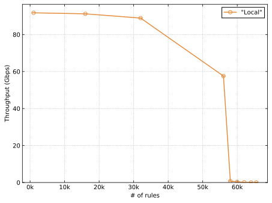
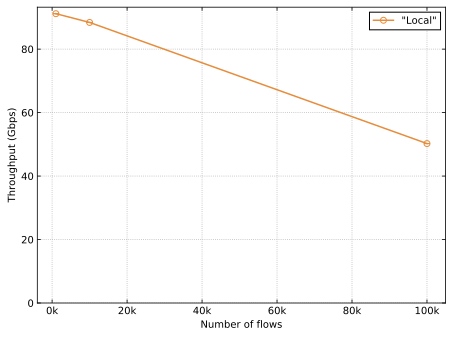
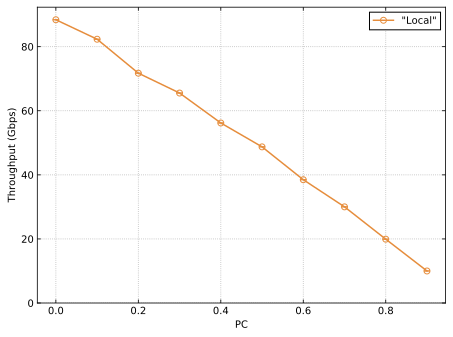

# NIC Bench experiments

The experiments are managed using [NPF](http://github.com/tbarbette/npf/), it will run the experiments presented in the NIC Bench paper multiple times. NPF will download and installed dependencies such as FastClick and the NIC-bench core. However the updated DPDK with the update API require external implementation.


## Dependencies and set-up

 * Install NPF and psutil with `python3 -m pip install --user npf psutil`
 * Install DPDK (see dpdk.org) (or our [modified version of DPDK](http://github.com/nicbench/dpdk/) if you want to test the new update API) :
 ```bash
 # Extract sources

   tar xf dpdk.tar.gz
   cd dpdk

 # Build libraries, drivers and test applications.
   meson build
   ninja -C build
   sudo ninja -C build install
 ```
 * Compile FastClick (all modifications have been merged into mainline FastClick). You need to export the RTE_SDK path to the DPDK directory, as we use some internal libraries of DPDK to parse flow rules.

```
export RTE_SDK=/home/tbarbette/workspace/dpdk
git clone https://github.com/tbarbette/fastclick.git
cd fastclick
./configure --enable-dpdk --enable-intel-cpu --verbose --enable-select=poll CFLAGS="-O3" CXXFLAGS="-std=c++11 -O3"  --disable-dynamic-linking --enable-poll --enable-bound-port-transfer --enable-local --enable-flow --disable-task-stats --disable-cpu-load --enable-flow-api
make
export NICBENCH_PATH=$(pwd)
```

## Running

We provide a Makefile to automatically run all tests. However it is best to start with a simplified single experiment to verify the setup is working:

### Running a single benchmark

With will run the Figure 2 test, measuring throughput and latency for table 0 for a various amount of rules.
```
npf-compare local --test nic-occupancy.npf \
    --cluster client=server0.mycluster.com dut=server1.mycluster.com \
    --variables PC=0 PORTS=0 PRIORITY=1 USE_UPSTREAM_DPDK=1 TABLE=0 MODEL=CX5 DUTSOCKET=0 NICBENCH_PATH=/home/tom/workspace/nicbench/ \
    --tags small nomatchresults
```
The most important thing to change in the line above are the value of NICBENCH_PATH, which should be the path to the compiled FastClick above, and the --cluster command which allows to set which machine will be the client, and which one will be the dut. By default the NICs will be sorted by order of speed, which should allow to have the first NIC as the dataplane one. You can append `,nic=1` to `client=server0.mycluster.com,nic=1` to select the second NIC. The list will be printed by NPF. For finer tuning refer to the NPF documentation.
If something is going wrong, add --show-full --show-cmd to see the commands and their output and try to solve the issue.

If everything goes smoothly, at the end of the tests you will have a path to automatically generated graphs such as this one for throughput:



Check out the NPF documentation to learn how to change axis labels, plot size, colors, etc... You can also export the data in CSV, panda matrix, ...

The file nic-occupancy.npf contains a description of the variables that can be changed, for instance fixing the number of rules to 4000000, using table 1 instead of table 0 and using 1000 to 100000 flows in the input load can be done with `--variables NRULES=4000000 TABLE=1 NFLOWS={1000,10000,100000}`.




Similarly, one can try to check the impact of matching only a default rule (general case in tests) and matching an increasing part of the rules themselves with `--variables NFLOWS=10000 PC=[0-1#0.1]`:




### Running all tests
Set up the parameters such as the cluster's IP addresses (the machines where the NIC are installed) and the path to the modified FastClick in common.sh

Just type make to run all experiments.


## Results of experiments (including other NICs)

Data for CX4, CX5 and CX6 can be found in the `plots` folder. BF1 is coming, stay tuned !

